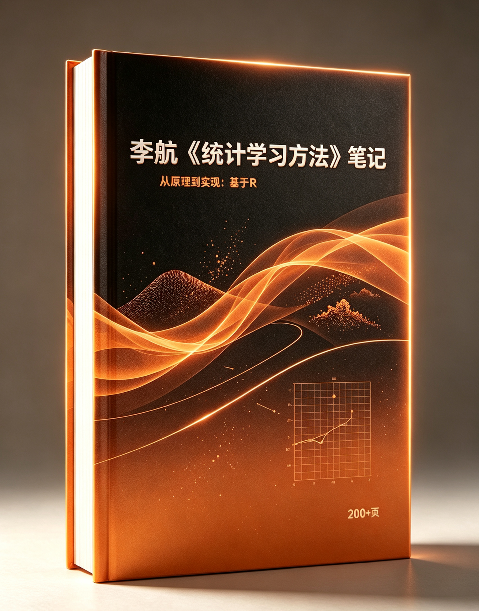

<div align="center">
  <!-- <p align="center">
    <h2>📚 lihang-notes:《统计学习方法-李航: 笔记-从原理到实现》🎉</h2>
  </p> -->
  <div align='center'>
    <br>
    
    
    
    
    
    
 </div>
</div>

📚 **lihang-notes**:《统计学习方法-李航: 笔记-从原理到实现》 这是一份非常详细的学习笔记，**200页PDF**🎉，各种手推公式细节讲解以及**R语言**实现，整理成PDF，有详细的目录，可结合《统计学习方法》提高学习效率。❤**如果觉得有用，不妨给个🌟Star支持一下吧~**❤

<div align="center">
  <p align="center">
    <a href="https://github.com/xlite-dev/lihang-notes/releases/download/v0.1.0/statistic.learning.R.Note.v0.1.0.pdf">🔥🔥 Download (©️PDF, 200 Pages) <点击下载!> 🎉🎉</a>
  </p>
</div>

## 📖 Contents ([Jump to ©️ Previews](#Previews))

- 第一章 统计学习方法概述 [©️<点击下载!> 🎉🎉](https://github.com/xlite-dev/lihang-notes/releases/download/v0.1.0/statistic.learning.R.Note.v0.1.0.pdf)
  - [1.6.2 泛化误差上界（P16-P17）](https://github.com/xlite-dev/lihang-notes/releases/download/v0.1.0/statistic.learning.R.Note.v0.1.0.pdf)
  - [1.4.2 过拟合与模型选择（P11）](https://github.com/xlite-dev/lihang-notes/releases/download/v0.1.0/statistic.learning.R.Note.v0.1.0.pdf)
- 第二章 感知机 [©️<点击下载!> 🎉🎉](https://github.com/xlite-dev/lihang-notes/releases/download/v0.1.0/statistic.learning.R.Note.v0.1.0.pdf)
  - [2.3.1 感知机算法的原始形式](https://github.com/xlite-dev/lihang-notes/releases/download/v0.1.0/statistic.learning.R.Note.v0.1.0.pdf)
  - [2.3.2 算法的收敛性（Novikoff 定理）（P31-P33）](https://github.com/xlite-dev/lihang-notes/releases/download/v0.1.0/statistic.learning.R.Note.v0.1.0.pdf)
  - [2.3.3 感知机学习算法的对偶形式（P33-P34）](https://github.com/xlite-dev/lihang-notes/releases/download/v0.1.0/statistic.learning.R.Note.v0.1.0.pdf)  
  - [2.3.1 感知机算法的原始形式（P28-P29）](https://github.com/xlite-dev/lihang-notes/releases/download/v0.1.0/statistic.learning.R.Note.v0.1.0.pdf) 
  - [2.3.3 感知机学习算法的对偶形式（P33-P34）](https://github.com/xlite-dev/lihang-notes/releases/download/v0.1.0/statistic.learning.R.Note.v0.1.0.pdf)  
- 第三章 K 近邻法 [©️<点击下载!> 🎉🎉](https://github.com/xlite-dev/lihang-notes/releases/download/v0.1.0/statistic.learning.R.Note.v0.1.0.pdf)
  - [3.2.2 距离度量（P39）](https://github.com/xlite-dev/lihang-notes/releases/download/v0.1.0/statistic.learning.R.Note.v0.1.0.pdf)   
  - [3.3.1 构造kd 树（P41-P42）](https://github.com/xlite-dev/lihang-notes/releases/download/v0.1.0/statistic.learning.R.Note.v0.1.0.pdf)   
- 第四章 朴素贝叶斯算法 [©️<点击下载!> 🎉🎉](https://github.com/xlite-dev/lihang-notes/releases/download/v0.1.0/statistic.learning.R.Note.v0.1.0.pdf)   
  - [4.1.1 基本方法（P47-P48）](https://github.com/xlite-dev/lihang-notes/releases/download/v0.1.0/statistic.learning.R.Note.v0.1.0.pdf)  
  - [4.1.2 后验概率最大化的含义（P48-49）](https://github.com/xlite-dev/lihang-notes/releases/download/v0.1.0/statistic.learning.R.Note.v0.1.0.pdf) 
  - [4.2.1 极大似然估计（P49）](https://github.com/xlite-dev/lihang-notes/releases/download/v0.1.0/statistic.learning.R.Note.v0.1.0.pdf)  
  - [4.2.2 学习与分类算法（P50-51）](https://github.com/xlite-dev/lihang-notes/releases/download/v0.1.0/statistic.learning.R.Note.v0.1.0.pdf)  
- 第五章 决策树 [©️<点击下载!> 🎉🎉](https://github.com/xlite-dev/lihang-notes/releases/download/v0.1.0/statistic.learning.R.Note.v0.1.0.pdf)   
  - [5.2.2 信息增益（P60-P61）](https://github.com/xlite-dev/lihang-notes/releases/download/v0.1.0/statistic.learning.R.Note.v0.1.0.pdf)   
  - [5.2.3 信息增益比（P63）](https://github.com/xlite-dev/lihang-notes/releases/download/v0.1.0/statistic.learning.R.Note.v0.1.0.pdf) 
  - [5.3.1 ID3 算法/C4.5 算法（P63-P65）](https://github.com/xlite-dev/lihang-notes/releases/download/v0.1.0/statistic.learning.R.Note.v0.1.0.pdf) 
  - [5.4 决策树的剪枝（P65-P67）](https://github.com/xlite-dev/lihang-notes/releases/download/v0.1.0/statistic.learning.R.Note.v0.1.0.pdf) 
  - [5.5.1 CART 生成（P68-P71）](https://github.com/xlite-dev/lihang-notes/releases/download/v0.1.0/statistic.learning.R.Note.v0.1.0.pdf) 
  - [5.5.2 CART 剪枝（P72-P73）](https://github.com/xlite-dev/lihang-notes/releases/download/v0.1.0/statistic.learning.R.Note.v0.1.0.pdf) 
- 第六章 逻辑斯蒂回归与最大熵模型 [©️<点击下载!> 🎉🎉](https://github.com/xlite-dev/lihang-notes/releases/download/v0.1.0/statistic.learning.R.Note.v0.1.0.pdf)   
  - [6.1.3 逻辑斯蒂回归模型的参数估计（P79）](https://github.com/xlite-dev/lihang-notes/releases/download/v0.1.0/statistic.learning.R.Note.v0.1.0.pdf) 
  - [6.2.3 最大熵模型的学习（P83-P85）](https://github.com/xlite-dev/lihang-notes/releases/download/v0.1.0/statistic.learning.R.Note.v0.1.0.pdf) 
  - [6.2.4 极大似然估计（P87）](https://github.com/xlite-dev/lihang-notes/releases/download/v0.1.0/statistic.learning.R.Note.v0.1.0.pdf) 
  - [6.3.1 改进的迭代尺度算法（P89-P91）](https://github.com/xlite-dev/lihang-notes/releases/download/v0.1.0/statistic.learning.R.Note.v0.1.0.pdf) 
- 第七章 支持向量机 [©️<点击下载!> 🎉🎉](https://github.com/xlite-dev/lihang-notes/releases/download/v0.1.0/statistic.learning.R.Note.v0.1.0.pdf)  
  - [7.1.3 间隔最大化（P101）](https://github.com/xlite-dev/lihang-notes/releases/download/v0.1.0/statistic.learning.R.Note.v0.1.0.pdf) 
  - [7.1.4 学习的对偶算法（P104）](https://github.com/xlite-dev/lihang-notes/releases/download/v0.1.0/statistic.learning.R.Note.v0.1.0.pdf) 
  - [7.2.3 支持向量（P113）](https://github.com/xlite-dev/lihang-notes/releases/download/v0.1.0/statistic.learning.R.Note.v0.1.0.pdf) 
  - [7.4 序列最小最优化算法（P126）](https://github.com/xlite-dev/lihang-notes/releases/download/v0.1.0/statistic.learning.R.Note.v0.1.0.pdf) 
- 第八章 提升方法 [©️<点击下载!> 🎉🎉](https://github.com/xlite-dev/lihang-notes/releases/download/v0.1.0/statistic.learning.R.Note.v0.1.0.pdf)  
  - [8.1.2 Adaboost 算法（P139）](https://github.com/xlite-dev/lihang-notes/releases/download/v0.1.0/statistic.learning.R.Note.v0.1.0.pdf) 
  - [8.2 AdaBoost 算法的训练误差分析（P142-P145）](https://github.com/xlite-dev/lihang-notes/releases/download/v0.1.0/statistic.learning.R.Note.v0.1.0.pdf) 
  - [8.3.2 前向分步算法与 AdaBoost（P145-P146）](https://github.com/xlite-dev/lihang-notes/releases/download/v0.1.0/statistic.learning.R.Note.v0.1.0.pdf) 
  - [8.4.3 梯度提升（P151）](https://github.com/xlite-dev/lihang-notes/releases/download/v0.1.0/statistic.learning.R.Note.v0.1.0.pdf) 
  - [8.1.3 AdaBoost 的例子（P140）](https://github.com/xlite-dev/lihang-notes/releases/download/v0.1.0/statistic.learning.R.Note.v0.1.0.pdf) 
- 第九章 EM 算法及其推广 [©️<点击下载!> 🎉🎉](https://github.com/xlite-dev/lihang-notes/releases/download/v0.1.0/statistic.learning.R.Note.v0.1.0.pdf)  
  - [9.2 EM 算法的收敛性（P161）](https://github.com/xlite-dev/lihang-notes/releases/download/v0.1.0/statistic.learning.R.Note.v0.1.0.pdf) 
  - [9.3.1 高斯混合模型（P163）](https://github.com/xlite-dev/lihang-notes/releases/download/v0.1.0/statistic.learning.R.Note.v0.1.0.pdf) 
  - [9.4 EM 算法的推广（P167）](https://github.com/xlite-dev/lihang-notes/releases/download/v0.1.0/statistic.learning.R.Note.v0.1.0.pdf) 
  - [9.3.1 高斯混合模型的 EM 算法（165）](https://github.com/xlite-dev/lihang-notes/releases/download/v0.1.0/statistic.learning.R.Note.v0.1.0.pdf) 
- 第十章 隐马尔可夫模型 [©️<点击下载!> 🎉🎉](https://github.com/xlite-dev/lihang-notes/releases/download/v0.1.0/statistic.learning.R.Note.v0.1.0.pdf)
  - [10.2.2 前向算法（P175-P176）](https://github.com/xlite-dev/lihang-notes/releases/download/v0.1.0/statistic.learning.R.Note.v0.1.0.pdf) 
  - [10.2.3 后向算法（P178-P179）](https://github.com/xlite-dev/lihang-notes/releases/download/v0.1.0/statistic.learning.R.Note.v0.1.0.pdf) 
  - [10.4.2 维特比算法（P185）](https://github.com/xlite-dev/lihang-notes/releases/download/v0.1.0/statistic.learning.R.Note.v0.1.0.pdf) 
  - [10.2.4 一些概率与期望值的计算（P179-P180）](https://github.com/xlite-dev/lihang-notes/releases/download/v0.1.0/statistic.learning.R.Note.v0.1.0.pdf) 
  - [10.2.2 前向算法（P175-P177）](https://github.com/xlite-dev/lihang-notes/releases/download/v0.1.0/statistic.learning.R.Note.v0.1.0.pdf) 
  - [10.2.3 后向算法（P178）](https://github.com/xlite-dev/lihang-notes/releases/download/v0.1.0/statistic.learning.R.Note.v0.1.0.pdf) 
  - [10.2.4 一些概率与期望值的计算（P179-P178）](https://github.com/xlite-dev/lihang-notes/releases/download/v0.1.0/statistic.learning.R.Note.v0.1.0.pdf) 
  - [10.3.1 监督学习方法（P180）](https://github.com/xlite-dev/lihang-notes/releases/download/v0.1.0/statistic.learning.R.Note.v0.1.0.pdf) 
  - [10.3.2 Baum-Welch 算法（P181-P184）](https://github.com/xlite-dev/lihang-notes/releases/download/v0.1.0/statistic.learning.R.Note.v0.1.0.pdf) 
  - [10.4.1 近似算法（P184）](https://github.com/xlite-dev/lihang-notes/releases/download/v0.1.0/statistic.learning.R.Note.v0.1.0.pdf) 
  - [10.4.2 维特比算法（P185-P186）](https://github.com/xlite-dev/lihang-notes/releases/download/v0.1.0/statistic.learning.R.Note.v0.1.0.pdf)
- 十一章 条件随机场 [©️<点击下载!> 🎉🎉](https://github.com/xlite-dev/lihang-notes/releases/download/v0.1.0/statistic.learning.R.Note.v0.1.0.pdf)  
- 参考文献 [©️<点击下载!> 🎉🎉](https://github.com/xlite-dev/lihang-notes/releases/download/v0.1.0/statistic.learning.R.Note.v0.1.0.pdf) 
- [附录 1 例 1.1 的 R 实现/训练误差与预测误差的对比](https://github.com/xlite-dev/lihang-notes/releases/download/v0.1.0/statistic.learning.R.Note.v0.1.0.pdf)
- [附录 2 线性可分/不可分感知机的 R 实现 ](https://github.com/xlite-dev/lihang-notes/releases/download/v0.1.0/statistic.learning.R.Note.v0.1.0.pdf)  
- [附录 3 离散特征的 2 维平衡 kd 树 R 代码 ](https://github.com/xlite-dev/lihang-notes/releases/download/v0.1.0/statistic.learning.R.Note.v0.1.0.pdf)  
- [附录 4 离散特征的朴素贝叶斯法 R 代码](https://github.com/xlite-dev/lihang-notes/releases/download/v0.1.0/statistic.learning.R.Note.v0.1.0.pdf)  
- [附录 5 决策树的实现的 R 代码](https://github.com/xlite-dev/lihang-notes/releases/download/v0.1.0/statistic.learning.R.Note.v0.1.0.pdf)  
- [附录 6 逻辑斯蒂回归及最大熵模型的 R 实现](https://github.com/xlite-dev/lihang-notes/releases/download/v0.1.0/statistic.learning.R.Note.v0.1.0.pdf)  
- [附录 7 基于 SMO 算法的支持向量机的 R 实现](https://github.com/xlite-dev/lihang-notes/releases/download/v0.1.0/statistic.learning.R.Note.v0.1.0.pdf)  
- [附录 8 提升算法的 R 代码](https://github.com/xlite-dev/lihang-notes/releases/download/v0.1.0/statistic.learning.R.Note.v0.1.0.pdf)  
- [附录 9 EM 算法的 R 实现](https://github.com/xlite-dev/lihang-notes/releases/download/v0.1.0/statistic.learning.R.Note.v0.1.0.pdf)  
- [附录 10 HMM 模型的 R 实现](https://github.com/xlite-dev/lihang-notes/releases/download/v0.1.0/statistic.learning.R.Note.v0.1.0.pdf)

## 📖 Previews

<div id="Previews"></div>

- 📚 目录 [©️<点击下载!> 🎉🎉](https://github.com/xlite-dev/lihang-notes/releases/download/v0.1.0/statistic.learning.R.Note.v0.1.0.pdf)


- 📚 K 近邻 [©️<点击下载!> 🎉🎉](https://github.com/xlite-dev/lihang-notes/releases/download/v0.1.0/statistic.learning.R.Note.v0.1.0.pdf)


- 📚 KD 树 [©️<点击下载!> 🎉🎉](https://github.com/xlite-dev/lihang-notes/releases/download/v0.1.0/statistic.learning.R.Note.v0.1.0.pdf)


- 📚 信息增益比 [©️<点击下载!> 🎉🎉](https://github.com/xlite-dev/lihang-notes/releases/download/v0.1.0/statistic.learning.R.Note.v0.1.0.pdf)
  


- 📚 支持向量机 [©️<点击下载!> 🎉🎉](https://github.com/xlite-dev/lihang-notes/releases/download/v0.1.0/statistic.learning.R.Note.v0.1.0.pdf)


- 📚 AdaBoost [©️<点击下载!> 🎉🎉](https://github.com/xlite-dev/lihang-notes/releases/download/v0.1.0/statistic.learning.R.Note.v0.1.0.pdf)


- 📚 隐马尔可夫模型 [©️<点击下载!> 🎉🎉](https://github.com/xlite-dev/lihang-notes/releases/download/v0.1.0/statistic.learning.R.Note.v0.1.0.pdf)


## ©️ License  

GNU General Public License v3.0  

## 🎉 Contribute  

<div id="Contribute"></div>

🌟如果觉得有用，不妨给个🌟👆🏻Star支持一下吧~

## ©️ Citations 

```BibTeX
@misc{lihang-notes@2019,
  title={lihang-notes: A detail note book of statistic-learning with R codes},
  url={https://github.com/xlite-dev/lihang-notes},
  note={Open-source software available at https://github.com/xlite-dev/lihang-notes},
  author={xlite-dev},
  year={2019}
}
```


